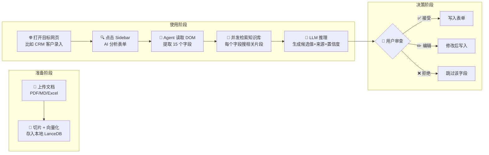

# 01 — 产品需求规格说明书 (PRD)

> **创建**: 2026-06 · **更新**: 2026-06-26
> **关联**: [02 系统架构](./02-system-architecture.md) · [03 UI/UX 设计](./03-ui-ux-design.md) · [06 开发计划](./06-development-plan.md)
> **状态**: ✅ 活跃 — Phase 1 已完成，Phase 2 表单检测+AI Tip+LLM Chat 已完成

---

## 📋 文档导航
> - [一句话概述](#一句话概述) · [为什么做这个](#为什么做这个) · [用户旅程](#用户旅程)
> - [功能清单](#功能清单) · [AI Agent 设计](#ai-agent-设计) · [竞品对比](#竞品对比)
> - [隐私底线](#隐私底线) · [项目阶段](#项目阶段) · [验收标准](#验收标准) · [FAQ](#faq)
>
> 🔧 **技术选型 & 架构** → 见 [`02-system-architecture.md`](./02-system-architecture.md)

---

## 一句话概述

> 🎯 **打开任意网页 → 分析表单 → 检索私有知识库 → AI Agent 决策 → 辅助填充，用户确认后写入。**

**核心价值**：把你自己电脑里的文档（合同、Excel、笔记）变成 AI 填表的"答案库"，不泄露隐私，不依赖特定平台。

---

## 为什么做这个

### 真实痛点

```
你每天打开 CRM、ERP、OA 系统，面对各种表单：
  ┌─────────────────────────────┐
  │  客户名称: [_____________]  │  ← 这个值在昨天那份合同 PDF 里
  │  合同编号: [_____________]  │  ← 这个值在上周的 Excel 表里
  │  联系地址: [_____________]  │  ← 这个值在邮件附件里
  │  ...15 个字段...            │
  └─────────────────────────────┘

现状：手动翻找文档 → 复制粘贴 → 来回切换窗口 → 容易出错
理想：点一下按钮 → AI 自动从你的文档中找到答案 → 你确认 → 填好
```

### 为什么现有工具不够

| 你的需求 | 现有工具能做到吗？ |
|---------|-------------------|
| 任意网站都能用 | ❌ 密码管理器只填账号密码，RPA 要逐站配置 |
| 理解我自己的文档 | ❌ ChatGPT 不知道你的合同里写了什么 |
| 数据不离开电脑 | ❌ 大多数 AI 工具都要上传到云端 |
| 不依赖特定 SaaS | ❌ 很多工具只对接 Salesforce 等特定平台 |

→ 所以我们自己做，用 Electron 桌面 App + 本地向量库 + AI Agent 的组合。

---

## 用户旅程



### 典型场景走一遍

**小王是销售，刚签完一份合同（PDF），现在要在公司 CRM 里录入客户信息：**

| 步骤 | 小王做什么 | 系统做什么 |
|------|-----------|-----------|
| **准备**（一次性的） | 把合同 PDF 拖进 Sidebar | 自动切片→向量化→存入本地知识库 |
| **打开页面** | 浏览器导航到 CRM 新建客户页 | Electron WebView 加载页面，Sidebar 在右侧等待 |
| **一键分析** | 点击 Sidebar 的 AI 填写 | Agent 扫描 DOM，提取出 15 个字段：公司名、联系人、电话… |
| **智能匹配** | 等待 2-3 秒 | 每个字段向量检索知识库 → LLM 推理 → 生成带来源的候选值 |
| **审查确认** | 看到列表：12 个绿色（高置信度）、3 个黄色（中等） | 侧栏显示：字段名 / 候选值 / 置信度 / 来源片段 |
| **微调** | 改了 1 个电话号码，点了另外 2 个的拒绝 | 实时预览即将填入的内容 |
| **一键填入** | 点击 全部应用 | 依次注入 JS 到 WebView，逐个填好 12 个字段 |
| **收工** | 表单填好了，手动点 CRM 的保存 | 操作记录写入本地审计日志（填了什么、来源是什么、时间） |

---

## 功能清单

### 功能 1 · 网页嵌入 ✅

| 项 | 说明 |
|----|------|
| **做什么** | 在 Electron 窗口内嵌入任意网页，右侧面板为 AI Sidebar |
| **怎么做** | Electron `<webview>` 加载目标 URL，支持前进/后退/刷新 |
| **用户看到** | 左边是正常的网页（和 Chrome 一样），右边是 Sidebar 控制面板 |
| **状态** | ✅ 已实施 — URL 导航栏、前进/后退/刷新、本地文件打开、历史记录 |

### 功能 2 · 表单检测 ✅

| 项 | 说明 |
|----|------|
| **做什么** | 自动识别当前页面所有可见表单字段 |
| **检测方式** | Chrome DevTools Protocol (CDP) `Accessibility.getFullAXTree` |
| **检测范围** | `<input>`、`<select>`、`<textarea>`、`[contenteditable]` |
| **提取信息** | 字段标签(label)、类型(type)、当前值、required/disabled/readonly 状态 |
| **状态** | ✅ 已实施 — CDP 零注入检测 + AX Tree 可视化 |

### 功能 3 · AI Tip 按钮 ✅

| 项 | 说明 |
|----|------|
| **做什么** | 鼠标悬停表单字段时浮现 ✨ 按钮，一键请求 AI 建议 |
| **怎么做** | WebView preload 注入 IIFE 脚本，hover/focus 时渲染浮动按钮 |
| **用户看到** | 字段右上角渐变紫色 ✨ 按钮 → 点击后在 Sidebar 展示建议 |
| **状态** | ✅ 已实施 — 含 label 推算、上下文收集、安全过滤 |

### 功能 4 · LLM 聊天 ✅

| 项 | 说明 |
|----|------|
| **做什么** | Chat-First 统一聊天界面，支持流式响应 |
| **支持模型** | 10 个 Provider：OpenAI、Anthropic、Ollama、DeepSeek、阿里云百炼、智谱、硅基流动、Moonshot、OpenRouter、自定义 |
| **会话模型** | Home + Chat 双视图，Page Overview + Field 钻入双会话 |
| **状态** | ✅ 已实施 — 流式 SSE、重试/超时、Adapter 模式、模型配置 UI |

### 功能 5 · 知识库 🔜

| 项 | 说明 |
|----|------|
| **做什么** | 用户上传私有文档，系统切片→向量化→本地存储，供后续检索 |
| **支持格式** | PDF、Markdown、HTML、纯文本（后期加 .docx、Excel） |
| **存储位置** | **纯本地** — LanceDB，文件在用户电脑上 |
| **检索方式** | 语义搜索（向量相似度），而非关键词匹配 |
| **状态** | ⚪ Phase 3 规划中 |

### 功能 6 · Agent 填充 🔜

| 项 | 说明 |
|----|------|
| **做什么** | 拿到表单字段列表后，结合知识库检索结果，AI 推理出每个字段的最佳候选值 |
| **输出格式** | `{ field, value, confidence: 0.92, sourceSnippet: "合同第三页..." }` |
| **Agent 工具** | `search_kb`（查知识库）、`fill_field`（填字段）、`read_field`（读字段） |
| **状态** | ⚪ Phase 4 规划中 |

---

## AI Agent 设计（🔜 Phase 4）

> **普通 LLM** = 一问一答的文本生成器。**AI Agent** = 能调用工具的自主决策者。
> 当前 Phase 2 实现了单轮 LLM 对话 + AI Tip 建议；Phase 4 将引入 Agent 循环实现多步推理填充。

### Agent 配备的工具

| 工具 | 输入 | 输出 | 说明 |
|------|------|------|------|
| `search_kb(query)` | 查询文本 | top-k 文档片段 + 来源 | 向量检索本地知识库 |
| `fill_field(selector, value)` | CSS 选择器 + 值 | 成功/失败 | 向 WebView 注入 JS 填充字段 |
| `read_field(selector)` | CSS 选择器 | 当前字段值 | 校验用（确认填对了） |

### Agent 执行流程

```
┌─────────────────────────────────────────────────┐
│  ① 用户点击 AI 填写                              │
│     ↓                                           │
│  ② 扫描 WebView DOM，提取字段列表                │
│     [{ label: "客户名称", type: "text",          │
│        selector: "#customer_name" }, ...]        │
│     ↓                                           │
│  ③ 并发向量检索（每个字段搜知识库）               │
│     search_kb("客户名称" + 页面上下文)            │
│     → ["合同甲方：张三科技...",                  │
│         "客户联系人：张三..."]                    │
│     ↓                                           │
│  ④ LLM 推理（字段 + 检索结果 → 候选值）          │
│     → { field: "客户名称",                       │
│          value: "张三科技有限公司",               │
│          confidence: 0.92,                       │
│          source: "2025-销售合同-v3.pdf 第3页" }   │
│     ↓                                           │
│  ⑤ 返回完整候选列表给 Sidebar 展示               │
│     ↓                                           │
│  ⑥ 用户确认后，Agent 调用 fill_field 逐个回填     │
└─────────────────────────────────────────────────┘
```

### Agent 的"聪明"之处

- **上下文感知**：不只是匹配字段名，会结合页面标题、URL、周围文字来理解语义
- **来源可追溯**：每个候选值都标注来自哪个文档的哪一段，可一键打开原文
- **置信度透明**：绿色(>0.8) 直接接受、黄色(0.5-0.8) 需确认、红色(<0.5) 仅为参考
- **只读不写（自动）**：Agent 绝不自动提交表单，最终控制权始终在用户手中

---

## 竞品对比

### 同类产品矩阵

| 产品 | 类型 | 本地隐私 | 私有 KB | 任意网页 | Agent 决策 | 桌面 App |
|------|------|:---:|:---:|:---:|:---:|:---:|
| **本产品** | 桌面 AI Agent | ✅ | ✅ | ✅ | ✅ | ✅ |
| OpenAI Operator | 云端 Agent | ❌ | ❌ | ✅ | ✅ | ❌ |
| Anthropic Computer Use | API Agent | ❌ | ❌ | ✅ | ✅ | ❌ |
| Browser Use (OSS) | 开源 Agent | ✅ | ❌ | ✅ | ✅ | ❌ |
| AnythingLLM | 桌面知识库 | ✅ | ✅ | ❌ | ❌ | ✅ |
| PrivateGPT | 本地 RAG | ✅ | ✅ | ❌ | ❌ | ✅ |
| Magical | 浏览器插件 | ❌ | ❌ | ✅ | ❌ | ❌ |
| 1Password / Dashlane | 密码管理器 | ✅ | ❌ | 部分 | ❌ | ❌ |
| UiPath / AA | 企业 RPA | ✅ | ❌ | ✅ | ❌ | ✅ |

### 我们的独特定位

```
🏆 市场空白 = 本地隐私 + 私有知识库 + 任意网页表单 + AI Agent + 桌面 App
```

没有人同时做这五件事。最接近的竞品各行其是：

- **Operator / Computer Use**：能力强但云端，不适合处理私密文档
- **AnythingLLM / PrivateGPT**：本地知识库强但不碰网页
- **RPA**：能填表但没有 AI 推理，每个表单都要手工配置
- **密码管理器**：只管账号密码，不懂你的业务文档

### 延伸机会（v2+ 可探索）

| 方向 | 价值 |
|------|------|
| **模板记忆** | 同一表单填过一次后记住映射，下次置信度接近 1.0 |
| **多表单工作流** | A 系统填完自动跳 B 系统，信息串联 |
| **知识库反哺** | 从已填表单提取新信息回写 KB（持续学习） |
| **团队共享 KB** | 团队知识库不泄密，共享检索但隔离数据 |
| **审批模式** | 高风险字段（金额、条款）需要二次人工确认 |

---

## 隐私底线

> ⚠️ **这是不可妥协的设计原则，不是可选项。**

| 原则 | 具体做法 |
|------|---------|
| 🏠 **数据本地化** | 知识库和向量库全部存储在用户电脑，不上传任何服务器 |
| 📦 **最小发送** | 调用 LLM 时只发送 `字段名 + 检索到的 KB 片段`，不发送整页 DOM |
| 🔌 **离线友好** | 支持配置本地 LLM（Ollama）+ 本地嵌入模型，实现完全离线运行 |
| 📝 **全量审计** | 每次填充操作记录：时间、字段、值、来源、用户决策（接受/编辑/拒绝） |
| 🔒 **不自动提交** | Agent 只填表单，绝不自动点击提交按钮 |

---

## 项目阶段

| 阶段 | 目标 | 交付物 | 状态 |
|------|------|--------|:----:|
| **Phase 1 · 骨架** | Electron App 能跑，WebView 能加载网页，Sidebar 能显示 | 基础项目结构、WebView + Sidebar 布局、URL 导航栏 | ✅ |
| **Phase 2 · 眼睛+嘴巴** | 表单检测 + AI Tip + LLM Chat | CDP 字段检测、✨ 悬浮按钮、流式聊天、10 Provider、双会话模型、i18n | ✅ |
| **Phase 3 · 大脑** | 知识库（上传、切片、向量化、检索） | 文档解析器、LanceDB 集成、RAG 检索 | ⚪ |
| **Phase 4 · 灵魂** | AI Agent 串联全流程，生成候选填充值 | Agent Loop、工具定义、批量填充 | ⚪ |
| **Phase 5 · 铠甲** | E2E 测试完善、审计日志、打包发布 | 完整测试覆盖、日志系统、自动更新 | ⚪ |

---

## 非目标（明确不做）

> 🚫 避免范围蔓延，第一阶段**明确不做**以下事情：

- ❌ 不自动提交表单（永远不做）
- ❌ 不训练/微调模型
- ❌ 不上传页面完整 HTML 到外部服务
- ❌ 不做多租户/团队管理（先单机版）
- ❌ 不做浏览器插件版（先聚焦 Electron）
- ❌ 不支持手机端（先桌面端）

---

## 验收标准

### Phase 1-2 已完成 ✅

- [x] 🔌 能加载任意网页并在 Sidebar 正常展示
- [x] 🔍 能检测页面表单字段（CDP Accessibility API）
- [x] ✨ AI Tip 按钮在表单字段 hover 时浮现
- [x] 💬 LLM 流式聊天（10 个 Provider、双会话模型）
- [x] 🌍 中英文双语支持（UI + AI 输出语言）
- [x] 🧪 Playwright E2E 测试（4 个用例）

### Phase 3-5 规划中 ⚪

- [ ] 📚 能上传 PDF/MD 文档并成功检索
- [ ] 🎯 Agent 能为表单字段生成带来源标注的候选值
- [ ] ✅ 批量回填到 WebView DOM
- [ ] 📝 完整审计日志可查看

---

## FAQ

<details>
<summary><b>Q: 和 ChatGPT 填表有什么不同？</b></summary>

ChatGPT 不知道你的私有文档内容，也不知道你当前在哪个页面。你需要手动复制粘贴。本产品自动读取表单 + 自动检索你的文档 + 自动填入。
</details>

<details>
<summary><b>Q: 我的文档安全吗？</b></summary>

文档全文**从不上传任何服务器**。只在你的电脑上切片、向量化、存储。调用 LLM 时只发字段名 + 少量相关片段，且支持纯本地 LLM。
</details>

<details>
<summary><b>Q: 支持哪些网页？</b></summary>

任何能在 Electron WebView 中打开的网页都支持。包括公司内网系统、SaaS 平台（Salesforce、HubSpot 等）、自建系统。不需要网页提供 API。
</details>

<details>
<summary><b>Q: 表单检测准确率 90% 是什么意思？</b></summary>

对于标准 HTML 表单（有 label、input 等标准标签），能正确识别至少 90% 的字段。动态渲染、复杂 Shadow DOM、Canvas 绘制的表单可能需要额外的适配。
</details>

<details>
<summary><b>Q: 需要联网吗？</b></summary>

如果你配置了本地 LLM（Ollama）+ 本地嵌入模型，**可以完全不联网**。如果用 OpenAI 等云端 API，则需要网络。推荐混合模式：嵌入用本地，推理用云端（速度快）。
</details>

<details>
<summary><b>Q: 能记住我的填写习惯吗？</b></summary>

v1 不做模板记忆，但这是 v2 最高优先级特性。同一表单填过一次后，Agent 会记住字段映射，下次置信度接近 1.0。
</details>
