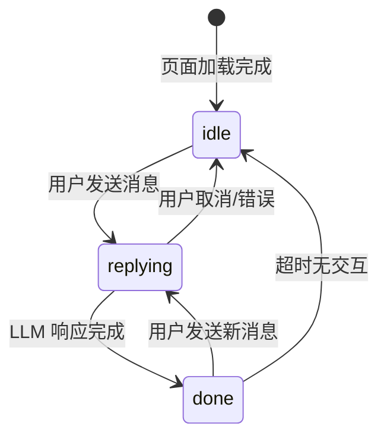
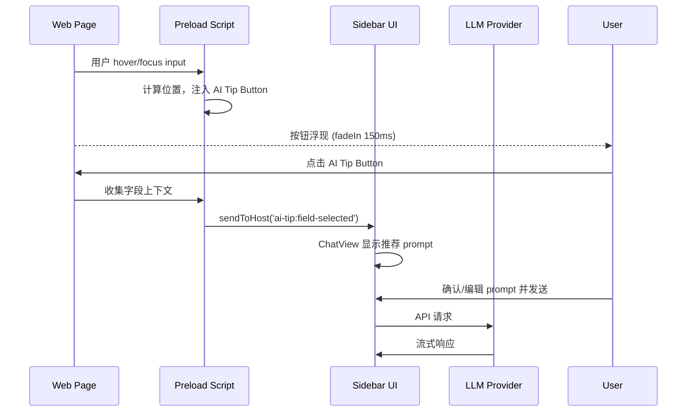

# 03 — UI/UX 设计文档

> **创建**: 2026-06-23 · **更新**: 2026-06-26
> **关联**: [01 产品规格](./01-product-spec.md) · [02 系统架构](./02-system-architecture.md) · [04 LLM Provider](./04-llm-provider-design.md)
> **状态**: ✅ Chat-First 布局已实施，Home/Chat 双视图已实施，AI Tip Button 已实施

---

## 目录

1. [核心设计理念：Chat-First](#1-核心设计理念chat-first)
2. [交互原则](#2-交互原则)
3. [Sidebar 布局](#3-sidebar-布局)
4. [组件树](#4-组件树)
5. [关键交互细节](#5-关键交互细节)
6. [状态机](#6-状态机)
7. [AI Tip Button 设计](#7-ai-tip-button-设计)
8. [业界参考](#8-业界参考)

---

## 1. 核心设计理念：Chat-First

> **Chat 不是 Sidebar 的一个面板，Chat 就是 Sidebar。**

旧方案的误区：把 LLM 能力拆成"AI 推荐面板" + "知识库问答对话框"两个独立 UI。这导致：

- 用户在两个界面间切换，认知负担高
- 表单填充和知识库问答其实可以自然融合
- 丢失了对话历史（上次填了什么？为什么推荐这个？）

**Chat-First 方案**：一个统一的 Chat 界面承载所有 AI 交互。

### 设计原型（Home + Chat 双视图）

Sidebar 有两个全屏视图，通过导航切换：

```
┌─ HOME 视图 ────────────────────┐  ┌─ CHAT 视图 ────────────────────┐
│ 🤖 AI Sidebar                  │  │ ← CRM > ✨ Company Name        │
│                                │  │                                │
│ 📍 Current Page                │  │ [💬 Overview][✨Company 2]     │
│ ┌────────────────────────────┐ │  │                                │
│ │ 🌐 CRM Customer Entry      │ │  │ 📎 Context from: Overview ▸   │
│ │ 💬 Overview          3 msgs│ │  │                                │
│ │ ✨ Company Name [text] 2   │ │  │ 👤 Suggest values...           │
│ │ ✨ Contact Email[email] 1  │ │  │ 🤖 Based on page context...    │
│ │ ▶ Show all 10 fields      │ │  │                                │
│ └────────────────────────────┘ │  │ ┌────────────────────────────┐ │
│                                │  │ │ Ask about Company Name...   │ │
│ 🕐 Recent Pages                │  │ └────────────────────────────┘ │
│ 🐙 GitHub Signup · 2h ago     │  │                                │
│ 🏦 Bank Transfer · yesterday  │  │                                │
└────────────────────────────────┘  └────────────────────────────────┘
```

> 📖 完整双视图交互流程见 [10 双会话 Context 传递设计](./10-context-session-design.md)

---

## 2. 交互原则

### 2.1 状态驱动，而非功能堆砌

| 状态 | WelcomeView | QuickActions | 说明 |
|------|:----------:|:----------:|------|
| 无 KB | 🤖 "How can I help you?" + Summarize prompt | 隐藏 | 纯探索状态 |
| 有 KB | 🤖 "How can I help you?" + Search KB(主) + Summarize | Search KB(主) + Summarize | 文档场景 |

### 2.2 操作层级（Visual Hierarchy）

- **Primary** — Solid 填充按钮，代表当前场景的主操作
- **Secondary** — Outline 按钮，辅助操作
- **Tertiary** — 文本链接/ghost，低频操作

### 2.3 渐进式信息展示

```
初始状态             对话开始后
    │                    │
    ▼                    ▼
 WelcomeView        QuickActions
 (通用欢迎)     (对话中快捷入口)
    │
    ▼
 ContextBar
 (页面+KB摘要)
```

### 2.4 减少认知负荷

- **不重复**：WelcomeView 和 QuickActions **不同时出现**
- **一键直达**：所有操作 chip 点击即发送，不需要额外确认

---

## 3. Sidebar 布局（Home + Chat 双视图）

Sidebar 有两个全屏视图，通过 `SidebarView` 状态切换（不是并排面板）：

```
Sidebar.vue (340px 宽, 100vh 高)
│
├── Home 视图（sidebarView === 'home'）
│   ├── HomeView
│   │   ├── 品牌头部 "AI Sidebar"
│   │   ├── 当前 Page Card（Overview + Field Sessions）
│   │   └── 历史 Pages 列表
│   └── SettingsDialog（叠加层）
│
└── Chat 视图（sidebarView === 'chat'）
    ├── ChatHeader（← 返回 + 面包屑 + 模型选择器）
    ├── FieldPills（inline pill bar + "+N more" overflow popup）
    ├── ContextBadge（Field 模式下显示 Context 来源）
    ├── ChatView（flex: 1, overflow-y: auto）
    │   ├── WelcomeView（无消息时）
    │   ├── AITipBanner（AI Tip 激活时）
    │   ├── UserMessage × N
    │   └── BotMessage × N（流式 Markdown + Fill/ContextChip/SuggestionChips）
    ├── ContextPill（Field 模式：活跃字段指示器）
    ├── ChatInput（底部固定：输入框 + 发送/停止）
    └── SettingsDialog（叠加层）
```

---

## 4. 组件树（实际实施）

```
src/renderer/src/components/
├── NavToolbar.vue                 # URL 导航栏（前进/后退/刷新/地址栏）
├── Sidebar.vue                    # 主容器：Home/Chat 双视图协调
│
├── sidebar/
│   ├── HomeView.vue               # 主页视图：当前 Page Card + 历史列表
│   ├── SettingsDialog.vue         # 设置对话框（模型管理 + 语言设置）
│   ├── ModelConfigDialog.vue      # 模型配置对话框（添加/编辑/测试连接）
│   ├── DetectedFieldsPanel.vue    # 折叠面板：检测到的字段列表
│   ├── FieldsView.vue             # 字段列表视图
│   ├── TreeView.vue               # AX Tree 可视化
│   ├── PageSummaryPanel.vue       # LLM 页面摘要面板
│   ├── ContextBar.vue             # 上下文感知栏
│   ├── ContextBadge.vue           # Field 模式下的 Context 来源标识
│   │
│   └── chat/                      # Chat 相关组件（13 个）
│       ├── ChatView.vue           # Chat 主容器（消息列表 + 滚动管理）
│       ├── ChatHeader.vue         # Chat 头部（返回 + 面包屑 + 模型选择）
│       ├── ChatInput.vue          # 输入框 + 发送/停止按钮
│       ├── WelcomeView.vue        # 空状态：欢迎语 + 建议 prompts
│       ├── UserMessage.vue        # 用户消息气泡
│       ├── BotMessage.vue         # AI 消息气泡（Markdown + 引用 + Fill 按钮）
│       ├── AITipBanner.vue        # AI Tip 字段建议横幅
│       ├── ContextPill.vue        # 活跃字段上下文标签
│       ├── ContextChip.vue        # Bot 消息中的 Context 来源引用
│       ├── FieldPills.vue         # inline pill bar + "+N more" overflow popup
│       ├── QuickActions.vue       # 快捷操作按钮
│       └── SuggestionChips.vue    # 建议追问 chips
│
└── shared/
    ├── CollapsiblePanel.vue       # 可折叠面板容器
    └── EmptyPlaceholder.vue       # 空状态占位
```

---

## 5. 关键交互细节

### 5.1 主页（HomeView）

```
┌──────────────────────────────────┐
│ 🤖 AI Sidebar                    │
│                                  │
│ 📍 Current Page                  │
│ ┌──────────────────────────────┐ │
│ │ 🌐 CRM Customer Entry        │ │
│ │    crm.example.com/customer   │ │
│ │──────────────────────────────│ │
│ │ 💬 Overview          3 msgs  │ │
│ │ ✨ Company Name [text] 2     │ │
│ │ ✨ Contact Email[email] 1    │ │
│ │ ▶ Show all 10 fields        │ │
│ └──────────────────────────────┘ │
│                                  │
│ 🕐 Recent Pages                  │
│ 🐙 GitHub Signup · 2h ago       │
│ 🏦 Bank Transfer · yesterday    │
└──────────────────────────────────┘
```

---

## 6. 状态机



| 状态 | ChatView | QuickActions | 输入框 | Stop 按钮 |
|------|----------|:-----------:|:------:|:---------:|
| **idle** | 显示历史消息 | ✅ 显示 | 可用 | 隐藏 |
| **replying** | 流式追加 BotMessage | 隐藏 | 禁用 | ✅ 显示 |
| **done** | 完整消息已显示 | ✅ 显示 | 可用 | 隐藏 |

---

## 7. AI Tip Button 设计

> 参考：Microsoft Edge Copilot（Sparkle 图标）、Grammarly（悬浮 Widget）、Notion AI（选中触发）

### 7.1 功能概述

用户 hover/focus 任意 `<input>` / `<textarea>` / `[contenteditable]` 时，控件右上角浮现 ✨ AI Tip 按钮。点击后将字段上下文发送到 Sidebar，LLM 给出智能建议。

### 7.2 交互流程



### 7.3 按钮 UI 规格

| 属性 | 值 |
|------|-----|
| 尺寸 | 28×28 px（默认）/ 24×24 px（输入框 <200px 宽） |
| 圆角 | 50%（正圆） |
| 图标 | ✨ Sparkle SVG |
| 背景 | `linear-gradient(135deg, #667eea 0%, #764ba2 100%)` |
| 阴影 | `0 2px 8px rgba(102, 126, 234, 0.4)` |
| 定位 | `position: absolute; top: -14px; right: 8px;` |
| 层级 | `z-index: 2147483646` |
| 动画 | fadeIn + slideDown 150ms ease-out; hover scale(1.15) |

### 7.4 状态

| 状态 | 视觉效果 |
|------|---------|
| **隐藏** | opacity: 0, pointer-events: none |
| **浮现** | fadeIn 150ms, 从上方 4px 滑入 |
| **Hover** | scale(1.15), 发光增强 |
| **Active** | scale(0.95) 按压反馈 |
| **加载中** | 旋转动画 |
| **消失** | fadeOut 150ms（鼠标移出 300ms 后） |

### 7.5 字段上下文收集

```typescript
interface FieldContext {
  tagName: string
  type: string          // text | email | number | password | ...
  name: string
  id: string
  placeholder: string
  value: string         // 当前已输入的值
  ariaLabel: string
  label: string         // 通过 <label for> 或启发式推算
  pageTitle: string
  pageUrl: string
  rect: { top: number; left: number; width: number; height: number }
}
```

**Label 推算优先级**：
1. `<label for="fieldId">` 关联
2. 包裹 `<input>` 的 `<label>` 元素
3. `aria-labelledby` 指向的元素
4. `aria-label` 属性
5. 同行/上一行文本节点（启发式）
6. 前一个 sibling 元素文本
7. `placeholder` 作为 fallback

### 7.6 安全考量

1. **密码字段排除**：`type="password"` 不显示按钮
2. **敏感字段检测**：含 `ssn`、`credit`、`card`、`cvv` 的字段默认不显示
3. **数据最小化**：仅发送字段结构，不发送用户已输入的实际值
4. **用户确认闸门**：点击后在 Sidebar 展示上下文摘要，确认后才发 API 请求

---

## 8. 业界参考

| 产品 | 借鉴点 |
|------|-------|
| **Microsoft Edge Copilot** | 表单字段 Sparkle 图标、页面上下文感知 |
| **Grammarly** | 悬浮 Widget、低侵入性交互 |
| **Notion AI** | 选中/聚焦触发 AI 入口 |
| **Monica / Sider** | Hover 浮现按钮、快捷指令 |
| **Kimi** | Chat-First 布局、上下文感知对话 |
| **Cursor** | AI 内嵌编辑体验 |
| **WeKnora** | 知识库检索 + RAG 对话 |
