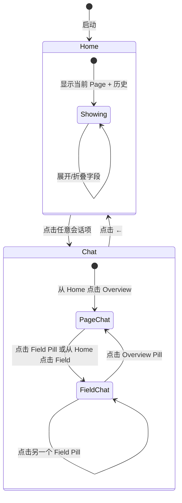

# 10 — 双会话 Context 传递设计

> **创建**: 2026-06-26 · **更新**: 2026-06-26（实现：Overview 对话作为 Context 源）
> **关联**: [03 UI/UX 设计](./03-ui-ux-design.md) · [09 Page Summary](./09-page-summary-design.md) · [04 LLM Provider](./04-llm-provider-design.md)
> **状态**: ✅ 已实现 — Context 传递机制完成

---

## 目录

1. [问题定义](#1-问题定义)
2. [核心概念：Home + Chat 双视图](#2-核心概念home--chat-双视图)
3. [UI 布局设计](#3-ui-布局设计)
4. [Context 传递机制](#4-context-传递机制)
5. [交互流程](#5-交互流程)
6. [组件设计](#6-组件设计)
7. [数据结构](#7-数据结构)
8. [UX 细节](#8-ux-细节)
9. [实现路线图](#9-实现路线图)
10. [附录：兼容性与决策](#10-附录兼容性与决策)

---

## 1. 问题定义

### 1.1 当前痛点

目前系统只有一个「扁平」的 Chat，所有消息（页面级问答、字段级 AI Tip）混在同一个消息列表里：

```
当前消息列表：
  👤 Summarize this page
  🤖 This is a CRM customer entry form...          ← 页面级对话
  👤 Suggest value for Company Name
  🤖 Based on the form context, try "Acme Corp"... ← 字段级对话
  👤 What does this page do?
  🤖 This page is used for...                      ← 又回到页面级
```

**问题**：

| 问题 | 影响 |
|------|------|
| **Context 不可见** | 用户不知道字段级对话"继承了"页面总结作为上下文 |
| **Session 混淆** | 页面讨论和字段填充混在一起，难以回溯 |
| **Context 丢失** | 切换到另一个字段后，前一个字段的对话历史还在，但 context 已经变了 |
| **缺乏信任感** | 用户看不到 AI 做决策的依据（用了哪些 context？） |

### 1.2 设计目标

> 把「页面是页面、字段是字段」的 **双会话模型** 做进 Sidebar UI，让 Context 从隐式注入变成**可见、可审查、可编辑**的一等公民。

具体目标：

1. **会话分离** — 页面级对话和字段级对话各自独立，互不污染
2. **Context 可见** — 字段对话标注"基于页面 Context X"，用户可展开查看
3. **无缝切换** — 页面↔字段切换流畅，不丢失各自状态
4. **Context 生命周期** — 页面 Context 随 URL 变化自动刷新；字段 Context 随字段切换而更新
5. **信任感** — 用户可以审查 AI 使用了哪些 Context 来做决策

---

## 2. 核心概念：Home + Chat 双视图

### 2.1 心智模型

Field Session **不能脱离 Page Session 独立存在**。Page 是上下文容器，Field 是 Page 内的子视图。

```
HOME（主页）
│
├── ● CRM Customer Entry              ← 当前 Page
│   ├── 💬 Overview                   ← Page Chat — 页面总览
│   ├── ✨ Company Name    [text]     ← Field Session（仅显示有交互的）
│   ├── ✨ Contact Email   [email]
│   └── ▶ Show all 10 detected fields ← 折叠全部检测字段
│
├── 🕐 GitHub Signup                  ← 历史 Page
├── 🕐 Bank Transfer Form             ← 历史 Page
└── 🕐 Insurance Claim                ← 历史 Page

点击任意项 → 进入 CHAT 视图
点击 ← → 返回 HOME
```

**核心隐喻**：

| 概念 | 隐喻 | 说明 |
|------|------|------|
| **Home** | 主页 / Dashboard | 铺满整个 Sidebar，展示当前 Page + 历史 Page |
| **Chat** | 详情页 | 展示某个会话（Page Chat 或 Field）的对话 |
| **Page Session** | 一个页面的完整交互上下文 | URL 加载时创建；URL 变化时归档 |
| **Page Chat** | Overview | 关于页面整体的对话。始终存在。 |
| **Field Session** | 钻入视图 | 关于单个字段的对话。用户点击 ✨ 时创建。 |
| **Active View** | 当前显示的内容 | Page Chat 或某个 Field |

### 2.2 关键定义

| 术语 | 定义 | 生命周期 |
|------|------|---------|
| **Page Session** | 一个页面的完整交互上下文 | 页面加载时创建；URL 变化时归档；回访时恢复 |
| **Page Chat** | Page 内的默认视图 | 随 Page 自动创建，不可删除 |
| **Page Context** | Page Chat 产出的页面语义总结 | 自动摘要 + 用户对话产出 |
| **Field Session** | Page 内的钻入视图 | 用户点击字段 ✨ 时创建；附属 Page |
| **Active View** | 当前 Sidebar 显示的内容 | 同一时刻只有一个（Page Chat 或 Field） |

### 2.3 Context 继承模型

**核心原则**：Page Context 由两层组成 — 自动摘要提供 baseline，Overview 对话进一步优化。

```
页面加载 → Auto-Summary (baseline)
                │
                ▼
         overviewContext = auto-summary ──────┐
                │                              │
    用户在 Overview 中讨论优化                   │
                │                              │
                ▼                              │
         overviewContext = 优化后的 AI 回复 ────┤
                                               │
           ┌───────────────────────────────────┤
           │ 注入          │ 注入          │ 注入
           ▼               ▼               ▼
      Field A          Field B          Field C

每个 Field Session 发送 LLM 请求时：
  system prompt ← overviewContext（优先级：Overview AI 回复 > 自动摘要）+ Field Metadata
  messages      ← 该 Field 自己的对话历史（NOT Overview Chat 的消息）
```

**关键约束**：
- Field 不能脱离 Page 存在
- `overviewContext` 优先级：Overview AI 回复 > 自动摘要 > 空
- 自动摘要完成后，所有 Field 立即可用（无需等用户聊天）
- 用户在 Overview 中聊天后，`overviewContext` 自动更新为优化版本

---

## 3. UI 布局设计

### 3.1 架构：Home + Chat 双视图

Sidebar 有两个全屏视图，通过导航切换（不是并排面板）：

```
┌─ HOME 视图 ────────────────────┐  ┌─ CHAT 视图 ────────────────────┐
│ 🤖 AI Sidebar                  │  │ ← CRM > ✨ Company Name        │
│                                │  │                                │
│ 📍 Current Page                │  │ [💬 Overview][✨Company 2][✨Email 1]│
│ ┌────────────────────────────┐ │  │                                │
│ │ 🌐 CRM Customer Entry      │ │  │ 📎 Context from: CRM ...      │
│ │ 💬 Overview          3 msgs│ │  │                                │
│ │ ✨ Company Name [text] 2   │ │  │ 👤 Suggest values...           │
│ │ ✨ Contact Email[email] 1  │ │  │ 🤖 Based on page context...    │
│ │ ▶ Show all 10 fields      │ │  │    📎 Source: CRM Entry ▸      │
│ └────────────────────────────┘ │  │                                │
│                                │  │ ┌────────────────────────────┐ │
│ 🕐 Recent Pages                │  │ │ Ask about Company Name...   │ │
│ 🐙 GitHub Signup               │  │ └────────────────────────────┘ │
│ 🏦 Bank Transfer               │  │                                │
│ 📋 Insurance Claim             │  │                                │
└────────────────────────────────┘  └────────────────────────────────┘
```

### 3.2 Home 视图

Home 是应用的"主页"，铺满整个 Sidebar。

#### 布局结构

```
┌─ Home ──────────────────────────┐
│ 🤖 AI Sidebar                   │  ← 品牌头部
│                                 │
│ 📍 Current Page                 │  ← 分区标题
│ ┌─ Page Card ─────────────────┐ │
│ │ 🌐 CRM Customer Entry       │ │  ← 卡片头部：图标 + 名称 + URL
│ │    crm.example.com/customer  │ │
│ │─────────────────────────────│ │
│ │ 💬 Overview          3 msgs │ │  ← 始终显示
│ │ ✨ Company Name [text] 2    │ │  ← 仅显示有 Session 的 Field
│ │ ✨ Contact Email[email] 1   │ │
│ │ ▶ Show all 10 fields       │ │  ← 折叠/展开全部检测字段
│ └─────────────────────────────┘ │
│                                 │
│ 🕐 Recent Pages                 │
│ 🐙 GitHub Signup · 2h ago      │  ← 历史 Page，点击恢复
│ 🏦 Bank Transfer · yesterday   │
│ 📋 Insurance Claim · yesterday │
└─────────────────────────────────┘
```

#### Field 显示策略（解决"很多字段"问题）

| 显示层级 | 内容 | 样式 |
|---------|------|------|
| **Session Fields** | 用户点过 ✨ 的字段（有对话） | 正常样式，显示消息数徽章 |
| **Overview** | Page Chat | 始终在第一行 |
| **折叠区** | 所有检测到但未交互的字段 | 点击 "Show all N fields" 展开，italic + 低透明度 |
| **空态** | 无 Session 时显示提示 | "No field sessions yet — click ✨ on any input" |

#### 交互规则

| 操作 | 效果 |
|------|------|
| 点击 Overview | 进入 Chat → Page Chat 视图 |
| 点击 Session Field | 进入 Chat → 该 Field 的对话 |
| 点击 "Show all N fields" | 展开/折叠全部检测字段 |
| 点击历史 Page | 恢复该 Page Session（若 WebView 匹配则自动导航） |

### 3.3 Chat 视图

从 Home 进入，铺满整个 Sidebar。

```
┌─ Chat ──────────────────────────┐
│ ← CRM > ✨ Company Name         │  ← Header：返回按钮 + 面包屑
├─────────────────────────────────┤
│ [💬 Overview] [✨ Company 2]    │  ← Field Pills：inline bar，超出显示 +N more
│ [✨ Contact Email 1]            │     （仅显示有 Session 的 Field，默认最多 4 个）
├─────────────────────────────────┤
│ 📎 Context from: CRM ...     ▸  │  ← ContextBadge：折叠/展开
├─────────────────────────────────┤
│                                 │  ← 消息区
│ 👤 Suggest values               │
│ 🤖 Based on page context...     │
│    📎 Source: CRM Entry ▸       │  ← ContextChip
├─────────────────────────────────┤
│ [Ask about Company Name...]  [➤]│  ← 输入框
└─────────────────────────────────┘
```

#### SessionHeader

```
Page Chat 模式：                     Field 模式：
┌──────────────────────────────┐   ┌──────────────────────────────────┐
│ ← CRM Customer Entry         │   │ ← CRM › ✨ Company Name         │
└──────────────────────────────┘   └──────────────────────────────────┘
```

- `←` 返回 Home
- 面包屑中的 Page 名称可点击 → 快速切到 Page Chat
- Field 名称不可点击（已是当前位置）

#### Field Pills

Inline pill bar，**仅显示有 Session 的 Field**，用于在 Chat 视图内快速切换字段，无需回 Home。默认最多显示 4 个 pill（1 Overview + 3 Fields），超出部分收进 `+N` 按钮，点击弹出下拉菜单选择。

```
[💬 Overview] | [✨ Company Name 2] [✨ Contact Email 1] [✨ Phone 2] [+3]
```

- 当前活跃的 pill 高亮（蓝色）
- 显示消息数徽章
- `+N` 按钮点击 → popup 菜单列出剩余 Field，选中后自动关闭
- 无 Session 时不显示此行

#### ContextBadge

仅在 Field 模式下显示，可折叠/展开。位于 Field Pills 下方、消息区上方。

Context 来源（优先级）：Overview AI 回复 > 自动摘要。

| 状态 | 展示 |
|------|------|
| **无 context（auto-summary 未就绪）** | `⏳ Generating page context…` |
| **有 context（折叠）** | `📎 Context from: Overview ▸` |
| **有 context（展开）** | 完整 context 文本 + `[Refine in Overview]` 按钮 |

#### ContextChip

出现在 Field 模式下 BotMessage 的末尾：
`📎 Source: CRM Customer Entry ▸`
点击 → ContextBadge 展开。

---

## 4. Context 传递机制

### 4.1 核心数据流

```
页面加载 → IPC_PAGE_SUMMARIZE → Auto-Summary (baseline)
                                       │
                                       ▼
                              overviewContext = auto-summary
                                       │
                        用户在 Overview 中讨论优化
                                       │
                                       ▼
                              overviewContext = 优化版本
                                       │
                                       ▼
                              Field system prompt
```

### 4.2 两种 Prompt 模式

在 `useChat.ts` 中，`sendMessage` 接受 `ChatContextOptions` 参数，控制 system prompt 的构建方式：

```typescript
// src/renderer/src/composables/useChat.ts

export type ChatContextMode = 'overview' | 'field'

export interface ChatContextOptions {
  mode: ChatContextMode
  overviewContext?: string   // Overview AI 回复文本（仅 field 模式）
  fieldMeta?: {              // 当前字段信息（仅 field 模式）
    label: string
    type: string
    value: string
    required: boolean
  }
}
```

#### Overview 模式（page-chat）

```
System Prompt（含 auto-summary baseline）:
  "You are an AI assistant embedded in a browser sidebar. Reply in Simplified Chinese.
   The user is currently viewing:
   - URL: https://insurance.example.com/claim/new
   - Page title: Insurance Claim Form

   Initial page understanding (auto-generated, you can refine this):
   这是一个保险公司客户信息登记表，包含公司信息、个人联系方式、
   保单详情和数据处理同意等字段。

   Discuss the page at a high level. Help the user understand the page's purpose,
   structure, and content.
   If the user asks to refine or correct the initial understanding,
   update your knowledge accordingly.
   Be concise and helpful."
```

**特点**：包含 auto-summary 作为 baseline，AI 可以在此基础上被用户纠正和优化。不传字段列表。

#### Field 模式（field）

```
System Prompt:
  "You are an AI assistant embedded in a browser sidebar. Reply in Simplified Chinese.
   The user is currently viewing:
   - URL: https://insurance.example.com/claim/new
   - Page title: Insurance Claim Form

   Page context (from Overview discussion):
   这是一个保险公司客户信息登记表，用户需要填写公司信息、个人联系方式、
   保单详情和数据处理同意等字段后提交。

   Current field the user is asking about:
   - Label: Policy Number
   - Type: text
   - Current value: "(empty)"
   - Required: yes

   Use the page context above to suggest meaningful values for this field.
   Be concise."
```

**特点**：包含 `overviewContext`（Overview 对话产出的页面理解）+ 当前字段元信息。

### 4.3 overviewContext 提取逻辑

在 `useSession.ts` 中自动完成，优先级：

```typescript
// src/renderer/src/composables/useSession.ts

const overviewContext = computed<string>(() => {
  const ps = activePageSession.value
  if (!ps) return ''

  // 1. 优先：Overview 对话中用户优化过的 AI 回复
  const overview = ps.children.find(c => c.key.type === 'page-chat')
  if (overview) {
    const aiMsgs = overview.messages.filter(
      m => m.role === 'assistant' && !m.isStreaming
    )
    if (aiMsgs.length > 0) {
      return aiMsgs[aiMsgs.length - 1].content  // 优化版本
    }
  }

  // 2. 回退：自动生成的页面摘要（baseline）
  if (ps.pageContext?.summary) {
    return ps.pageContext.summary
  }

  return ''
})
```

### 4.4 Context 的完整生命周期

```
页面加载 → Auto-Summary → baseline context ────▶ Field 可用（无需等聊天）
                                                     │
                        用户在 Overview 中讨论 ────────┤
                              │                      │
                              ▼                      ▼
                         优化后的 context ──────▶ Field 自动获得最新版本
```

```
无 overviewContext：Field "Policy Number" → AI: "Try 'POL-001'"  ← 泛泛
有 overviewContext：
  Overview AI 回复："这是保险公司登记表，保单号格式为 XXX-XXXX-XXXX"
  → Field "Policy Number" → AI: "Try 'PLC-2024-0831'"           ← 精准
```

---

## 5. 交互流程

### 5.1 状态机



### 5.2 核心流程

**流程 1：页面加载 → Home**
```
WebView 加载 URL → 创建 Page Session（含 Overview 子会话）→ Home 显示当前 Page Card
→ 字段检测完毕 → Home 更新字段计数
```

**流程 2：Home → Overview Chat**
```
用户点击 Overview → 进入 Chat 视图 → Header 显示 Page 名称
→ 消息区显示 Overview 对话历史
→ System prompt 仅含 URL + title（无字段列表）
→ 输入框 placeholder "Ask about this page..."
```

**流程 3：Overview 对话 → 产生 Context**
```
用户在 Overview 中提问（如 "这个页面是什么？"）
→ AI 回复（如 "这是一个保险公司信息登记表..."）
→ useSession.overviewContext 自动提取该 AI 回复
→ 所有 Field 会话即刻获得最新的页面理解
```

**流程 4：用户点击字段 ✨ → Field Session**
```
用户点击 WebView 中 ✨ → Field 加入 Session Fields
→ 若在 Home：该 Field 出现在 Page Card 中
→ 若在 Chat：进入该 Field 的对话 / Field Pills 更新
→ ContextBadge 显示 overviewContext（或提示 "Chat in Overview first"）
→ WelcomeView 显示字段专用 chips
```

**流程 5：Field 聊天**
```
用户在 Field 中提问（如 "保单号填什么？"）
→ System prompt = overviewContext + 当前字段信息
→ AI 结合页面理解给出精准建议
```

**流程 6：Field 切换**
```
用户点击 Field Pill → Chat 内容切换到该 Field 的历史
→ ContextBadge 保持（同一个 Page Context）
→ Header 面包屑更新
```

**流程 7：返回 Home**
```
点击 ← → Home 视图 → 当前 Page Card 的活跃项高亮
```

**流程 8：URL 变化**
```
新 URL → 当前 Page 归档到历史区 → 新 Page Session 创建
→ Home 刷新 → 默认激活新 Page 的 Overview
```

---

## 6. 组件设计

### 6.1 新增组件

| 组件 | 路径 | 职责 |
|------|------|------|
| `HomeView.vue` | `sidebar/HomeView.vue` | 主页：当前 Page Card + 历史 Page 列表 |
| `ChatHeader.vue` | `sidebar/chat/ChatHeader.vue` | 返回按钮 + 面包屑导航 |
| `FieldPills.vue` | `sidebar/chat/FieldPills.vue` | 横向滚动 Field 快速切换 |
| `ContextBadge.vue` | `sidebar/ContextBadge.vue` | Field 模式下的 Context 展示，来源=Overview 对话 |
| `ContextChip.vue` | `sidebar/chat/ContextChip.vue` | BotMessage 中的 Context 溯源标签 |

### 6.2 修改组件

| 组件 | 变更 |
|------|------|
| `Sidebar.vue` | Home ↔ Chat 视图切换；集成 HomeView、ChatHeader、ContextBadge |
| `ChatView.vue` | 增加 FieldPills；按 session 过滤消息 |
| `BotMessage.vue` | 条件渲染 ContextChip |
| `useChat.ts` | 新增 `ChatContextMode`、`ChatContextOptions` 类型；`sendMessage` 按模式构建不同 system prompt（overview=轻量无字段 / field=含 overviewContext+字段信息） |

### 6.3 HomeView 设计

```
┌─ Home ──────────────────────────┐
│ 🤖 AI Sidebar                   │
│                                 │
│ 📍 Current Page                 │
│ ┌─────────────────────────────┐ │
│ │ 🌐 CRM Customer Entry   ●   │ │  ← Page Card（卡片容器）
│ │    crm.example.com/customer  │ │
│ │─────────────────────────────│ │
│ │ 💬 Overview          3 msgs │ │  ← 始终第一行
│ │ ✨ Company Name [text] 2    │ │  ← Session Field（有交互）
│ │ ✨ Contact Email[email] 1   │ │
│ │ ▶ Show all 10 fields       │ │  ← 折叠/展开切换
│ │   • Website         [url]  │ │  ← 展开后的检测字段（灰色）
│ │   • Industry      [select] │ │
│ │   • Tax ID         [text]  │ │
│ │   ...                       │ │
│ └─────────────────────────────┘ │
│                                 │
│ 🕐 Recent Pages                 │
│ 🐙 GitHub Signup · 2h ago      │
│ 🏦 Bank Transfer · yesterday   │
└─────────────────────────────────┘
```

**排序规则**：
- 当前 Page 永远在顶部（卡片容器）
- Overview 始终第一行
- Session Fields 按 lastActiveAt 倒序
- 折叠区按检测顺序
- 历史 Page 按 lastActiveAt 倒序，最多 20 个

### 6.4 FieldPills 设计

```
Chat 模式下，Header 下方显示：

[💬 Overview] [✨ Company Name 2] [✨ Contact Email 1]

- 横向滚动（overflow-x: auto，隐藏滚动条）
- ● 活跃 pill = 蓝色高亮
- ○ 非活跃 pill = 灰色边框
- 显示消息数徽章
- 无 Session 时不显示此行
```

### 6.5 ContextBadge 设计

仅在 Field 模式下显示。三种状态，Context 来源=auto-summary 或 Overview 对话：

| 状态 | 展示 |
|------|------|
| **无 Context（auto-summary 未就绪）** | `⏳ Generating page context…` |
| **有 Context（折叠）** | `📎 Context from: Overview ▸` |
| **有 Context（展开）** | 完整文本 + `[Refine in Overview]` |

视觉：浅蓝背景 + 左边框蓝色细线，与消息区分隔。

### 6.6 ContextChip 设计

BotMessage 底部（仅 Field 的 assistant 消息）：
`📎 Source: CRM Customer Entry ▸`
点击 → ContextBadge 展开。

---

## 7. 数据结构

### 7.1 核心类型

```typescript
export interface PageSessionData {
  pageId: string
  pageUrl: string
  pageTitle: string
  pageContext: PageContext | null
  children: SubSession[]        // [PageChat, ...FieldSessions]
  activeChildIndex: number
  isArchived: boolean
  createdAt: number
  lastActiveAt: number
}

export interface SubSession {
  key: SessionKey               // type: 'page-chat' | 'field'
  fieldMeta?: FieldContext      // 仅 Field
  messages: ChatMessageItem[]
  createdAt: number
  lastActiveAt: number
}

export interface ChatMessageItem {
  id: string
  role: 'user' | 'assistant'
  content: string
  timestamp: number
  sessionKey: SessionKey
  usedPageContext?: boolean     // assistant 消息是否引用了 Page Context
}

export type SidebarView = 'home' | 'chat'
```

### 7.2 Composable: `useSession.ts`

```typescript
export function useSession() {
  const pageSessions = ref<PageSessionData[]>([])
  const activePageIndex = ref<number>(-1)
  const sidebarView = ref<SidebarView>('home')
  const fieldSessionNames = computed(() => /* 当前 Page 下有 Session 的字段名集合 */)

  // Context
  const overviewContext: ComputedRef<string>          // Overview 最后一条 AI 回复
  const hasOverviewContext: ComputedRef<boolean>      // 是否已有上下文

  // Methods
  function initPageSession(url, title): PageSessionData
  function activateFieldSession(fieldMeta): void
  function selectView(sessionKey): void    // Home → Chat
  function goHome(): void                  // Chat → Home
  function sendMessage(text, modelId?): Promise<void>
  function updatePageContext(summary): void

  return { /* ... */ }
}
```

---

## 8. UX 细节

### 8.1 多 Field 策略

| 层级 | 内容 | 行为 |
|------|------|------|
| **Overview** | Page Chat | 始终显示 |
| **Session Fields** | 用户点过 ✨ 的字段 | 默认显示，带消息数徽章 |
| **折叠区** | 全部检测字段 | "Show all N" 切换展开 |
| **Field Pills** | Chat 内快速切换 | 仅显示 Session Fields |

### 8.2 边界情况

| 场景 | 处理 |
|------|------|
| 页面 50+ 字段，只交互 3 个 | Home 只展示 3 个 Session Field + 折叠其余 |
| 无 Page Context 时进入 Field | ContextBadge 显示 "Generating page context…"（若 auto-summary 未就绪）；或直接显示 auto-summary |
| URL 变化 | 当前 Page 归档 → 历史区 |
| 回访之前页面 | 从历史区恢复 Page Session |
| 容量 | 最多 20 个 Page Session |

### 8.3 Empty States

| 状态 | 展示 |
|------|------|
| Home 无任何 Page | 引导提示 "Open a page to start" |
| Home 当前 Page 无 Field Session | "No field sessions yet — click ✨" |
| Chat Page Chat 无消息 | WelcomeView + 通用 chips |
| Chat Field 无消息 + 有 Context | WelcomeView + 字段专用 chips + ContextBadge |
| Chat Field 无消息 + 无 Context | WelcomeView + ContextBadge "Generating page context…" |

---

## 9. 实现路线图

### Phase 1：数据结构 + useSession

- [ ] 定义 `PageSessionData`、`SubSession`、类型
- [ ] 创建 `useSession.ts` composable
- [ ] 重构 `useChat.ts`：扁平 → 层级管理
- [ ] 消息增加 `sessionKey`、`usedPageContext`

### Phase 2：Home + Chat 双视图

- [ ] 实现 `HomeView.vue`（Page Card + 历史列表 + "Show all" 折叠）
- [ ] 实现 `ChatHeader.vue`（← 返回 + 面包屑）
- [ ] 实现 `FieldPills.vue`
- [ ] 修改 `Sidebar.vue`：Home ↔ Chat 切换
- [ ] 修改 `ChatView.vue`：按 session 过滤 + 集成 FieldPills

### Phase 3：Context 可见化

- [ ] 实现 `ContextBadge.vue`
- [ ] 实现 `ContextChip.vue`
- [ ] 修改 `BotMessage.vue`：条件渲染 ContextChip

### Phase 4：UX 打磨

- [ ] 视图切换过渡动画
- [ ] Page Session 归档/恢复
- [ ] 空状态完善
- [ ] Field Pills overflow popup 交互打磨

---

## 10. 附录：兼容性与决策

### 附录 A：与现有设计的兼容性

本设计是对现有 Chat-First 模型的**增强**：

| 现有概念 | 新设计中的对应 |
|---------|--------------|
| `useChat.messages` | `useSession.currentMessages`（按 activeSubSession 过滤） |
| `useChat.sendMessage()` | `useSession.sendMessage()`（自动选择子会话 + system prompt） |
| `PageSummaryPanel` | 合并到 `ContextBadge`（仅 Field 模式显示） |
| `ContextPill` | 合并到 `ChatHeader` 面包屑（"Page › Field"） |
| `WelcomeView` | 保留，增加 session-aware chips |
| `DetectedFieldsPanel` | 保留不变 |

**不破坏现有功能**：Page Chat 的行为与当前 Chat 完全一致。

### 附录 B：设计决策记录

| 决策 | 选项 | 选择 | 理由 |
|------|------|------|------|
| 视图架构 | 抽屉 vs 主页 | **Home + Chat 双视图** | Home 铺满 Sidebar，不藏在抽屉后；← 返回而非 [☰] 切换 |
| 多 Field 展示 | 全量 vs 仅 Session | **仅 Session + 折叠全部** | 50 字段页面只展示交互过的 3 个；"Show all" 折叠其余 |
| Field 快速切换 | 回 Home vs Pills | **Field Pills（+N overflow popup）** | 无需回 Home，在 Chat 内一键切换 |
| 导航模式 | 分段控件 vs 文件夹 vs 导航 | **导航式层级** | Field 附属 Page，不可独立存在 |
| Session 持久化 | 持久化 vs 仅内存 | **仅内存** | 会话临时性强，URL 变化即失效 |
| Page Session 上限 | 10 / 20 / 无限制 | **20 个** | 平衡历史与内存 |
| Context 编辑 | 影响历史 vs 不影响 | **不影响** | 历史消息 immutable |
| 自动摘要 vs 对话生成 | 二选一 vs 并存 | **并存** | 自动提供 baseline，对话深度定制 |
