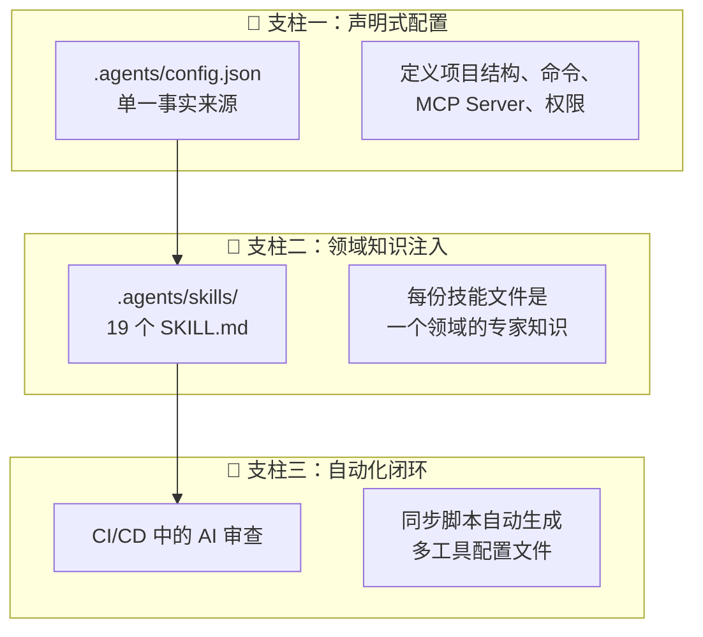
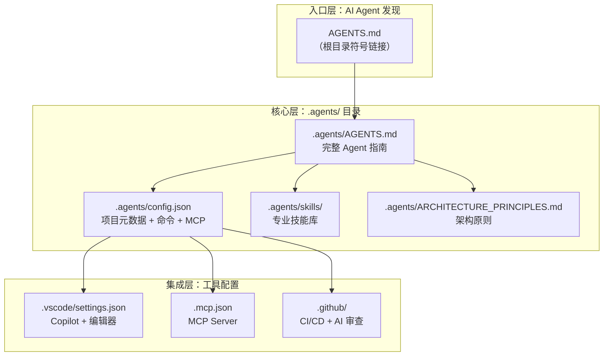

# 附录 — AI 编码基础设施

> **创建**: 2026-06 · **更新**: 2026-06-25（移至附录）
> **关联**: [06 开发计划](../06-development-plan.md)
> **状态**: 📋 已实施 — `.agents/` 体系、Skills 技能库、VS Code 集成均已就位
>
> 本文档记录项目 AI 编码基础设施的设计决策和实施结果。

---

## 目录

1. [Langfuse 经验提炼](#1-langfuse-经验提炼)
2. [当前项目差距分析](#2-当前项目差距分析)
3. [AI 编码基础设施设计](#3-ai-编码基础设施设计)
4. [Skills 技能库设计](#4-skills-技能库设计)
5. [GitHub Copilot 集成方案](#5-github-copilot-集成方案)
6. [CI/CD AI 工作流](#6-cicd-ai-工作流)
7. [实施路线图](#7-实施路线图)

---

## 1. Langfuse 经验提炼

### 1.1 核心设计哲学

Langfuse 的 AI 编码体系围绕 **三大支柱** 构建：



### 1.2 可复用的关键做法

| # | 做法 | 价值 | 适用场景 |
|---|------|------|---------|
| 1 | **`.agents/config.json` 统一配置** | 避免每个工具重复配置，一处修改全局生效 | ✅ 所有项目 |
| 2 | **`AGENTS.md` 作为入口指南** | AI Agent 读取的第一个文件，建立上下文 | ✅ 所有项目 |
| 3 | **按领域拆分的 Skills** | 精确注入领域知识，避免 Token 浪费 | ✅ 多领域项目 |
| 4 | **同步脚本 (`agents:sync`)** | 自动生成 Claude/Cursor/Codex 配置 | ⚠️ 多工具时 |
| 5 | **`postinstall` 自举** | 安装依赖时自动同步 Agent 配置 | ✅ 团队协作 |
| 6 | **CI/CD 中的 AI Code Review** | PR 自动安全/质量审查 | ✅ 有 CI 时 |
| 7 | **MCP Server 配置** | Agent 可直接调用外部工具（Playwright、API 文档等） | ✅ 有外部工具依赖 |
| 8 | **`ARCHITECTURE_PRINCIPLES.md`** | AI 做决策时的判断准则 | ✅ 有架构复杂度 |

### 1.3 不适合当前项目的做法

| 做法 | 原因 |
|------|------|
| 完整的 `agents:sync` 多工具同步 | 当前仅聚焦 GitHub Copilot + VS Code，过度工程化 |
| 19 个复杂 Skills | 本项目规模约为 Langfuse 的 1/20，5-7 个精选 Skills 足够 |
| Linear/DataDog 集成 | 项目目前无这些 SaaS 依赖 |
| Claude Code 安全审查 | 需要额外 API Key，可后期引入 |

---

## 2. 当前项目差距分析

### 2.1 AI 编码就绪度评估

```
                   当前   目标
AI Agent 指南      ░░░░   ████   AGENTS.md
Skills 技能库      ░░░░   ████   5-7 个 SKILL.md
VS Code 配置       ██░░   ████   settings + extensions + copilot
CI/CD AI           ░░░░   ███░   GitHub Actions
MCP 集成           ░░░░   ██░░   1-2 个 MCP Server
文档完备度         ████   ████   已较好
```

### 2.2 具体差距

| 缺失项 | 影响 | 优先级 |
|--------|------|:----:|
| 无 `AGENTS.md` | Copilot 每次对话从零理解项目，效率低 | 🔴 高 |
| 无 Skills 技能文件 | Copilot 不理解 Electron/WebView/IPC 等核心技术栈 | 🔴 高 |
| 无 `.vscode/settings.json` Copilot 配置 | 无法利用 Copilot 的 instructions 功能 | 🟡 中 |
| 无 `.github/` 目录 | 无 CI/CD，无 PR 模板，无 AI 审查 | 🟡 中 |
| 无 `.mcp.json` | Copilot Agent 无法调用 Playwright 等外部工具 | 🟢 低 |
| 无 `copilot-instructions.md` | 缺少项目级 Copilot 自定义指令 | 🟡 中 |

---

## 3. AI 编码基础设施设计

### 3.1 总体架构



### 3.2 目录结构

```
project-root/
├── AGENTS.md                          # → .agents/AGENTS.md 符号链接
├── .mcp.json                          # MCP Server 配置（Copilot 自动发现）
│
├── .agents/                           # 🔷 AI 编码单一事实来源
│   ├── AGENTS.md                      #   完整 Agent 指南（入口文件）
│   ├── config.json                    #   项目元数据 + 命令 + 工具配置
│   ├── ARCHITECTURE_PRINCIPLES.md     #   架构决策原则
│   └── skills/                        #   专业技能库
│       ├── electron-architecture.md   #   Electron 主进程/渲染进程/IPC
│       ├── vue3-component.md          #   Vue 3 组件开发规范
│       ├── form-filling-security.md   #   表单填写安全规范
│       ├── ipc-communication.md       #   IPC 通信模式
│       ├── knowledge-base.md          #   知识库/LanceDB 集成
│       └── playwright-testing.md      #   Playwright E2E 测试
│
├── .github/                           # CI/CD + AI 工作流
│   ├── PULL_REQUEST_TEMPLATE.md       #   PR 模板
│   ├── copilot-instructions.md        #   Copilot 项目级自定义指令
│   └── workflows/
│       ├── ci.yml                     #   类型检查 + Lint + 测试
│       └── copilot-code-review.yml    #   Copilot AI 代码审查（可选）
│
└── .vscode/                           # VS Code 配置
    ├── settings.json                  #   编辑器 + Copilot 设置
    ├── extensions.json                #   推荐扩展
    └── launch.json                    #   调试配置（已有）
```

---

## 4. Skills 技能库设计

### 4.1 技能清单

| # | 技能文件 | 触发场景 | 内容概要 |
|---|---------|---------|---------|
| 1 | `electron-architecture.md` | 任何涉及 main/preload/renderer 的修改 | Electron 进程模型、安全边界、IPC 模式、webview 隔离 |
| 2 | `vue3-component.md` | 修改/新建 Vue 组件 | Composition API、provide/inject、props/emits 规范、命名约定 |
| 3 | `form-filling-security.md` | 表单填写相关代码 | 三级回退策略、XSS 防护、selector 安全校验 |
| 4 | `ipc-communication.md` | IPC 通道定义/修改 | contextBridge、通道命名规范、类型安全、错误处理 |
| 5 | `knowledge-base.md` | 知识库/LanceDB 相关 | 向量存储模式、嵌入模型选择、RAG 管线 |
| 6 | `playwright-testing.md` | E2E 测试编写 | Playwright + Electron 集成、表单测试模式 |

### 4.2 技能文件模板

每个 `SKILL.md` 应包含：

```markdown
# {技能名称}

## 何时使用
- 明确触发场景

## 核心规则
1. 规则 1 — 一句话 + 代码示例
2. 规则 2 — 一句话 + 代码示例

## 代码模式
### 正确 ✅
```ts
// 正确示范
```

### 错误 ❌
```ts
// 错误示范 + 解释为什么错
```

## 关联文件
- `src/xxx.ts` — 说明
```

---

## 5. GitHub Copilot 集成方案

### 5.1 VS Code 配置增强

`.vscode/settings.json` 需增加：

```jsonc
{
  // === Copilot 核心 ===
  "github.copilot.chat.localeOverride": "zh-CN",
  "github.copilot.chat.codesearch.enabled": true,
  "github.copilot.chat.commitMessageGeneration.instructions": [
    // 使用 conventional commits
  ],
  "github.copilot.chat.testGeneration.instructions": [
    // 使用 Vitest + @vue/test-utils
  ],

  // === Copilot 编辑 ===
  "github.copilot.chat.edits.enabled": true,
  "github.copilot.chat.edits.mode": "inline",

  // === 上下文 ===
  "github.copilot.chat.search.semanticText.enabled": true,
  "github.copilot.chat.scopeSelection": true,

  // === 代码补全 ===
  "github.copilot.enable": {
    "*": true,
    "markdown": true
  }
}
```

### 5.2 Copilot Instructions（自定义指令）

创建 `.github/copilot-instructions.md`（GitHub Copilot 会自动发现）：

```markdown
# Copilot Instructions for electron-ai-sidebar

## Project Context
- Electron 桌面应用，Vue 3 + TypeScript + electron-vite
- 主进程 (src/main/) 有完整 Node.js API，渲染进程通过 preload 桥接
- WebView 标签嵌入外部网页，通过 preload 脚本与渲染进程通信
- 表单检测和 AI 辅助填写是核心功能

## Code Style
- 使用 Composition API (`<script setup lang="ts">`)
- Prefer `const` over `let`, use arrow functions
- Use `provide/inject` for same-renderer communication, IPC for cross-process
- All IPC channels must be typed via `src/shared/ipc-types.ts`
- Use `electron-log` for logging, never `console.log` in production code

## Testing
- Vitest for unit tests, Playwright for E2E
- Test files co-located with source: `__tests__/` subdirectory
```

### 5.3 MCP 集成

创建 `.mcp.json`（Copilot 在 VS Code 中自动加载）：

```json
{
  "mcpServers": {
    "playwright": {
      "command": "npx",
      "args": ["-y", "@playwright/mcp@latest", "--isolated", "--save-session"]
    }
  }
}
```

Playwright MCP 可以让 Copilot Agent 直接操控浏览器进行 E2E 测试验证。

---

## 6. CI/CD AI 工作流

### 6.1 基础 CI（类型检查 + Lint + 测试）

```yaml
# .github/workflows/ci.yml
name: CI
on: [push, pull_request]
jobs:
  check:
    runs-on: ubuntu-latest
    steps:
      - uses: actions/checkout@v4
      - uses: pnpm/action-setup@v4
      - run: pnpm install
      - run: pnpm typecheck
      - run: pnpm lint
      - run: pnpm test
```

### 6.2 AI 代码审查（可选，后期引入）

当项目进入 Phase 4+ 阶段，可集成 Copilot Code Review：

```yaml
# .github/workflows/copilot-code-review.yml
name: Copilot Code Review
on:
  pull_request:
    types: [opened, synchronize, reopened, ready_for_review]
jobs:
  review:
    runs-on: ubuntu-latest
    permissions:
      contents: read
      pull-requests: write
    steps:
      - uses: actions/checkout@v4
      - name: GitHub Copilot Code Review
        uses: github/copilot-code-review@v1
        with:
          token: ${{ secrets.GITHUB_TOKEN }}
```

---

## 7. 实施路线图

### Phase A：即刻实施（今天）

| 步骤 | 产出 | 工作量 |
|------|------|:----:|
| 1 | 创建 `AGENTS.md` + `.agents/AGENTS.md` | 30 min |
| 2 | 创建 `.agents/config.json` | 15 min |
| 3 | 创建 `.agents/ARCHITECTURE_PRINCIPLES.md` | 30 min |
| 4 | 增强 `.vscode/settings.json`（Copilot 配置） | 15 min |
| 5 | 增加 `.vscode/extensions.json` 推荐扩展 | 5 min |
| 6 | 创建 `.github/copilot-instructions.md` | 20 min |

### Phase B：本周内

| 步骤 | 产出 | 工作量 |
|------|------|:----:|
| 7 | 创建 5 个核心 Skills（electron/vue3/ipc/security/kb） | 2-3 h |
| 8 | 创建 `.mcp.json`（Playwright MCP） | 10 min |
| 9 | 创建 `.github/workflows/ci.yml` | 20 min |
| 10 | 创建 `.github/PULL_REQUEST_TEMPLATE.md` | 10 min |

### Phase C：后续迭代

| 步骤 | 产出 | 工作量 |
|------|------|:----:|
| 11 | Playwright E2E 测试 Skill + 示例测试 | 1 h |
| 12 | GitHub Copilot Code Review Action | 30 min |
| 13 | 根据实际使用反馈迭代 Skills | 持续 |

---

## 附录：与 Langfuse 方案的关键差异

| 维度 | Langfuse | 本项目（建议） | 理由 |
|------|----------|---------------|------|
| AI 工具范围 | Claude + Codex + Cursor + VS Code | **仅 GitHub Copilot + VS Code** | 聚焦单一工具，避免维护成本 |
| Skills 数量 | 19 个 | **5-7 个精选** | 项目规模小，按需增长 |
| 同步脚本 | `agents:sync` 自研脚本 | **不需要** | 单工具无同步需求 |
| CI/CD AI | Claude Code 安全审查 | **Copilot Code Review**（后期） | 优先 CI 基础建设 |
| MCP Server | 3 个（docs/linear/playwright） | **1 个（Playwright）** | 聚焦 E2E 测试场景 |
| 自举 postinstall | 自动同步 Agent 配置 | **不需要** | 单工具无同步需求 |
